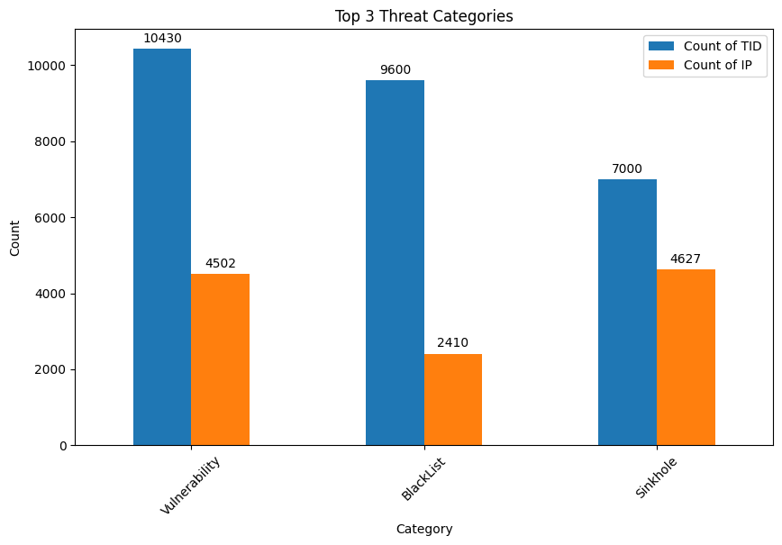
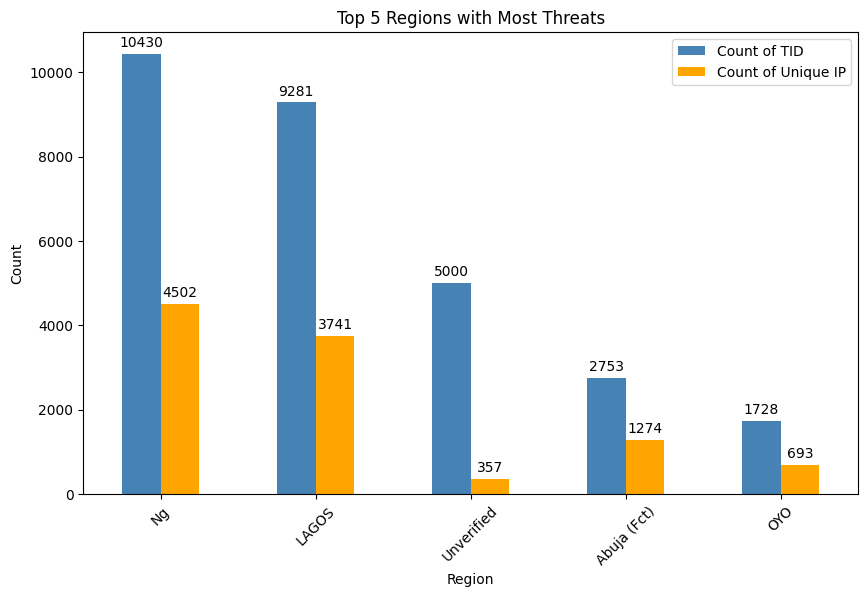
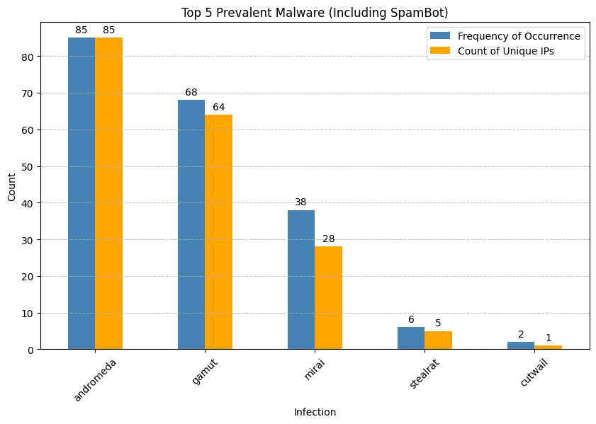
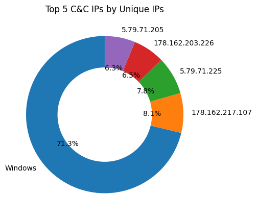

# Threat Intelligence Report  

## 🏁 Executive Summary  
- **Primary Threats:** Vulnerability (10,430 TIDs) and Blacklist (9,600 TIDs) dominate, followed by Sinkhole (7,000 TIDs).  
- **Key Target:** Nigeria (particularly Lagos) is the most affected region, with significant unverified data (5,000 TIDs) indicating potential geolocation inaccuracies.  
- **Critical Findings:**  
  - Windows OS is the most targeted platform (3,071 unique C2 IPs).  
  - Andromeda malware is the most prevalent (85 occurrences).  
- **Urgent Alerts:** Zero-day browser vulnerability (June 24) and banking trojan campaign (June 23) require immediate attention.  

---  

## 📊 Threat Landscape Analysis  

### 🔍 Top Threat Categories

| Category       | Frequency (TIDs) | Unique IPs |  
|----------------|------------------|------------|  
| Vulnerability  | 10,430           | 4,502      |  
| Blacklist      | 9,600            | 2,410      |  
| Sinkhole       | 7,000            | 4,627      |  

**Insight:** Vulnerability exploits are the leading threat vector, requiring prioritized patching efforts.  

---  

### 🌍 Geographic Hotspots  

| Region         | Frequency (TIDs) | Unique IPs |  
|----------------|------------------|------------|  
| Nigeria (Ng)   | 10,430           | 4,502      |  
| Lagos          | 9,281            | 3,741      |  
| Unverified     | 5,000            | 357        |  
| Abuja (Fct)    | 2,753            | 1,274      |  
| OYO            | 1,728            | 693        |  

**Anomaly:** High "Unverified" entries (12% of total) suggest geolocation data gaps.  

---  

### 🦠 Malware Activity  

| Malware Family | Frequency | Unique IPs |  
|----------------|-----------|------------|  
| Andromeda      | 85        | 85         |  
| Gamut          | 68        | 64         |  
| Mirai          | 38        | 28         |  

**Trend:** Andromeda’s 100% IP uniqueness indicates widespread, non-repeating infections.  

---  

### ⚙️ C&C_IP Infrastructure  

| C&C IP             | Affected Unique IPs |  
|--------------------|---------------------|  
| Windows OS         | 3,071               |  
| 178.162.217.107    | 351                 |  
| 5.79.71.225        | 336                 |  

**Observation:** Windows dominates attack surfaces (72% of C&C-linked IPs).  

---  

## 🚨 Active Alerts  
| Date       | Type          | Title                      | Severity       |  
|------------|---------------|----------------------------|----------------|  
| 2025-06-24 | Vulnerability | Simulated Zero-Day in Browser | 🚨 High Alert  |  
| 2025-06-23 | Malware       | Banking Trojan Campaign    | 🚨 High Alert  |  

**Action Items:**  
1. Patch browser vulnerabilities immediately.  
2. Monitor financial sector networks for trojan activity.  

---  

## 📌 Appendix  
- **Data Sources:** NCC-CSIRT advisories, internal telemetry.  
- **Methodology:** AI-driven analysis of 28,000+ threat indicators.  
- **Visualizations:** See Figures 1–4 in source dataset.  

**Disclaimer:** Automated report—verify critical findings manually.  